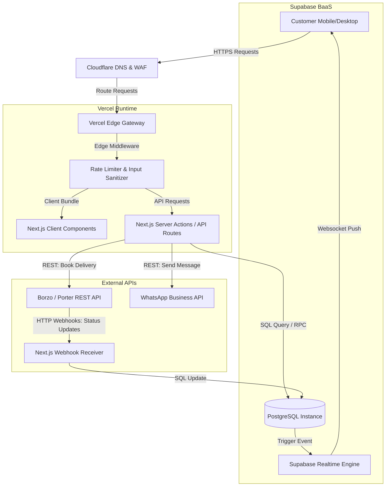
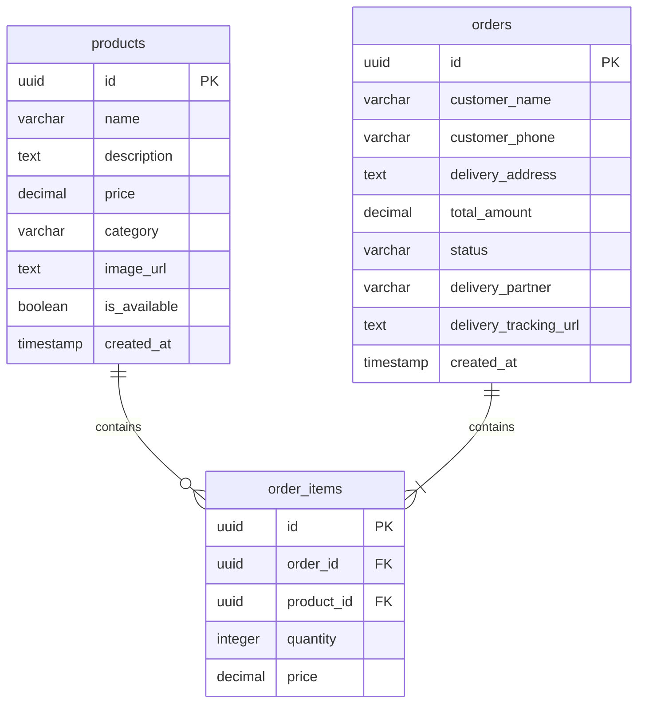
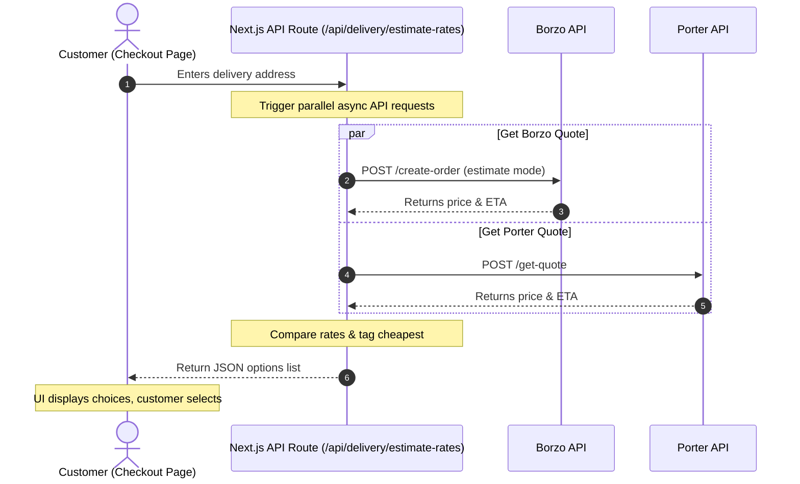

# Detailed Technical Architecture: OM Store E-Commerce Platform

This document defines the production-grade architecture, database schema, api specs, security policies, and third-party logistics integration parameters for the OM Store web application.

---

## 1. System Topology & Data Flow



---

## 2. Design System & Frontend Specifications

To achieve the "cozy heritage" branding, the styling system maps typography and colors to strict variables.

### 2.1 CSS Design Tokens (`index.css`)
```css
:root {
  /* Color Palette */
  --color-bg-primary: #FDFBF7;    /* Soft Cream (Warm background) */
  --color-bg-secondary: #F6F3EB;  /* Light Oatmeal (Cards and fields) */
  --color-text-primary: #1C2E24;  /* Dark Spruce (Deep Slate-Green for readable text) */
  --color-text-muted: #5C6E64;    /* Sage Muted (Secondary text) */
  --color-brand-primary: #C85C40; /* Terracotta (Headers, primary links) */
  --color-brand-accent: #E29E4B;  /* Honey (CTA buttons, status highlights) */
  --color-border: #E8E2D5;        /* Soft sand border */

  /* Typography */
  --font-display: 'Playfair Display', Georgia, serif;
  --font-sans: 'Outfit', 'Inter', system-ui, sans-serif;

  /* Layout and Transitions */
  --radius-sm: 4px;
  --radius-md: 12px;
  --transition-smooth: all 0.3s cubic-bezier(0.4, 0, 0.2, 1);
  --shadow-warm: 0 4px 20px rgba(28, 46, 36, 0.05);
}
```

### 2.2 Component Hierarchy & Routing
Next.js Page layout and component tree:
```
app/
├── layout.js              # Load Google Fonts (Playfair Display & Outfit), Context Providers
├── page.js                # Home (Catalog & Heritage storytelling panel)
├── checkout/
│   └── page.js            # Billing/delivery address forms, payment summary card
├── track/
│   └── [order_id]/
│       └── page.js        # Order progress visualizer and Borzo dynamic tracking card
components/
├── Header.js              # Sticky Navigation & floating shopping cart count
├── ProductCard.js         # Single product listing (image, price, availability status, CTA)
├── CartDrawer.js          # Slide-out cart overlay
└── OrderTracker.js        # Progress bar showing state timeline
```

---

## 3. Database Layer & Relational Schema (PostgreSQL)

To ensure referential integrity, performance, and security, the database tables utilize constraints, indexes, and Row-Level Security (RLS).



### 3.1 DDL Schema Definition
```sql
-- Create Enum for Order Status
CREATE TYPE order_status AS ENUM ('received', 'preparing', 'dispatched', 'delivered', 'cancelled');

-- 1. Products Table
CREATE TABLE products (
    id UUID PRIMARY KEY DEFAULT gen_random_uuid(),
    name VARCHAR(255) NOT NULL,
    description TEXT,
    price DECIMAL(10, 2) NOT NULL CHECK (price >= 0.00),
    category VARCHAR(50) NOT NULL CHECK (category IN ('specialty', 'general')),
    image_url TEXT,
    is_available BOOLEAN DEFAULT TRUE,
    created_at TIMESTAMP WITH TIME ZONE DEFAULT TIMEZONE('utc'::text, NOW()) NOT NULL
);

-- 2. Orders Table
CREATE TABLE orders (
    id UUID PRIMARY KEY DEFAULT gen_random_uuid(),
    customer_name VARCHAR(255) NOT NULL CHECK (char_length(customer_name) > 0),
    customer_phone VARCHAR(20) NOT NULL,
    delivery_address TEXT NOT NULL,
    total_amount DECIMAL(10, 2) NOT NULL CHECK (total_amount >= 0.00),
    status order_status DEFAULT 'received'::order_status NOT NULL,
    delivery_partner VARCHAR(50) CHECK (delivery_partner IN ('borzo', 'porter', 'manual')),
    delivery_tracking_url TEXT,
    created_at TIMESTAMP WITH TIME ZONE DEFAULT TIMEZONE('utc'::text, NOW()) NOT NULL
);

-- 3. Order Items Table
CREATE TABLE order_items (
    id UUID PRIMARY KEY DEFAULT gen_random_uuid(),
    order_id UUID NOT NULL REFERENCES orders(id) ON DELETE CASCADE,
    product_id UUID NOT NULL REFERENCES products(id) ON DELETE RESTRICT,
    quantity INTEGER NOT NULL CHECK (quantity > 0),
    price DECIMAL(10, 2) NOT NULL CHECK (price >= 0.00)
);
```

### 3.2 Performance Optimization Indexes
```sql
-- Index foreign keys and search criteria to optimize join speeds and tracking page queries
CREATE INDEX idx_order_items_order_id ON order_items(order_id);
CREATE INDEX idx_order_items_product_id ON order_items(product_id);
CREATE INDEX idx_orders_status ON orders(status);
CREATE INDEX idx_products_category ON products(category) WHERE is_available = TRUE;
```

### 3.3 Row-Level Security (RLS) Policies
By default, all tables restrict access. RLS allows public customers to browse products and place/track orders, but blocks editing access.
```sql
ALTER TABLE products ENABLE ROW LEVEL SECURITY;
ALTER TABLE orders ENABLE ROW LEVEL SECURITY;
ALTER TABLE order_items ENABLE ROW LEVEL SECURITY;

-- Product policies: Anyone can read available products, only admins can alter
CREATE POLICY select_public_products ON products 
    FOR SELECT USING (is_available = TRUE);

-- Orders policies: Anyone can create an order, but you can only read it if you know the order UUID
CREATE POLICY insert_public_orders ON orders 
    FOR INSERT WITH CHECK (true);

CREATE POLICY select_tracked_order ON orders 
    FOR SELECT USING (id = id); -- Verified by knowing the private UUID
```

---

## 4. API Spec & Middleware Routing

All backend logic runs as serverless functions.

### 4.1 Order Placement (`POST /api/checkout`)
*   **Request Payload:**
    ```json
    {
      "customer_name": "Hriday",
      "customer_phone": "+919876543210",
      "delivery_address": "Flat 402, Oakwood Appts, Andheri West, Mumbai, 400053",
      "items": [
        { "product_id": "4b68fd58-9c1a-429a-8b65-72fd5b9d365f", "quantity": 2 },
        { "product_id": "8c45d312-3b2d-45ff-81ba-c9aefdb450ef", "quantity": 1 }
      ]
    }
    ```
*   **Response Payload (201 Created):**
    ```json
    {
      "success": true,
      "order_id": "893c52e1-45bd-4001-a982-b7e61a4f0012",
      "total_amount": 450.00,
      "status": "received"
    }
    ```

### 4.2 Security Middleware: Edge Rate Limiter
Implemented inside Next.js edge runtime `/middleware.js`:
```javascript
import { NextResponse } from 'next/server';
import { Ratelimit } from '@upstash/ratelimit';
import { Redis } from '@upstash/redis';

// Simple Redis-backed rate limiter for serverless environments
const ratelimit = new Ratelimit({
  redis: Redis.fromEnv(),
  limiter: Ratelimit.slidingWindow(3, '10 m'), // 3 requests per 10 mins
});

export async function middleware(request) {
  if (request.nextUrl.pathname.startsWith('/api/checkout')) {
    const ip = request.ip ?? '127.0.0.1';
    const { success } = await ratelimit.limit(ip);
    
    if (!success) {
      return new NextResponse(
        JSON.stringify({ error: 'Too many checkout attempts. Please try again in 10 minutes.' }),
        { status: 429, headers: { 'Content-Type': 'application/json' } }
      );
    }
  }
  return NextResponse.next();
}
```

---

## 5. Third-Party Integrations (Borzo & WhatsApp)

### 5.1 Borzo Delivery API Integration Flow
Once an order is created, the system triggers the booking:

```
[Customer Checkout] ---> [Next.js API Handler] 
                               |
                               | (Calculates volume/weight)
                               v
                     [POST to Borzo Sandbox/Prod]
```

*   **API Endpoint (Borzo):** `https://robot.borzodelivery.com/api/business/1.1/create-order`
*   **Headers:** `X-DV-Auth-Token: <YOUR_TOKEN>`
*   **Post Payload:**
    ```json
    {
      "matter": "OM Store Order #893c52e1",
      "points": [
        {
          "address": "OM Store, Shop No. 5, Market Road, Chembur, Mumbai",
          "contact_person": { "phone": "+919999999999" }
        },
        {
          "address": "Flat 402, Oakwood Appts, Andheri West, Mumbai, 400053",
          "contact_person": {
            "name": "Hriday",
            "phone": "+919876543210"
          }
        }
      ],
      "vehicle_type_id": 8 -- 8 = Motorcycle/2-wheeler
    }
    ```
*   **Response from Borzo (Excerpt):**
    ```json
    {
      "is_successful": true,
      "order": {
        "order_id": 9987410,
        "delivery_price": "120.00",
        "tracking_url": "https://borzodelivery.com/in/track/9987410"
      }
    }
    ```
    *Next.js will write this `tracking_url` and `delivery_price` back to the database, updating the order.*

---

### 5.2 Borzo Webhook Event Handler (`POST /api/delivery/webhook`)
Borzo sends updates when the order status changes.
*   **Payload from Borzo:**
    ```json
    {
      "event": "status_changed",
      "order_id": 9987410,
      "status": "courier_assigned",
      "courier": {
        "name": "Ramesh Kumar",
        "phone": "+919123456789"
      }
    }
    ```
*   **Middleware Logic:**
    1.  Verify the webhook signature to ensure it originates from Borzo.
    2.  Map Borzo's status value:
        *   `active` / `courier_assigned` $\rightarrow$ Update database status to `preparing` or `dispatched`.
        *   `completed` $\rightarrow$ Update database status to `delivered`.
    3.  Updates are pushed to the customer's browser via Supabase Realtime (Websockets).

---

### 5.3 WhatsApp Notifications (via Twilio API)
Triggered when the order status transitions to `dispatched` or `delivered`.
*   **Customer Message Template:**
    > "Hi {customer_name}, your order from OM Store has been packed and dispatched via {delivery_partner}! Track your rider here: {tracking_url}"
*   **Owner Message Template:**
    > "New Order #{order_id} received. Deliver to: {address}. Items: {items}. Chosen Partner: {delivery_partner}. Fare: {price}."

---

## 6. Multi-Carrier Rate Comparison Engine (Borzo vs. Porter)

To give customers the best price, the checkout page performs a real-time rate comparison during address entry.



### 6.1 Rate Estimation Endpoint (`GET /api/delivery/estimate-rates`)
*   **Request Parameters:**
    *   `pickup_address` (string)
    *   `delivery_address` (string)
*   **Response Payload (200 OK):**
    ```json
    {
      "pickup": "OM Store, Chembur",
      "destination": "Andheri West, Mumbai",
      "options": [
        {
          "partner": "porter",
          "display_name": "Porter (Eco Delivery)",
          "price": 85.00,
          "currency": "INR",
          "eta_minutes": 35,
          "is_cheapest": true
        },
        {
          "partner": "borzo",
          "display_name": "Borzo (Express Delivery)",
          "price": 98.00,
          "currency": "INR",
          "eta_minutes": 22,
          "is_cheapest": false
        }
      ]
    }
    ```

### 6.2 Checkout Selection UI Component
A simple interactive UI radio-button group showing the options:
```html
<div class="delivery-options">
  <h3>Choose Delivery Partner</h3>
  
  <label class="option-card cheapest">
    <input type="radio" name="delivery_partner" value="porter" checked>
    <div class="option-details">
      <span class="partner-name">Porter (Eco Delivery)</span>
      <span class="eta">35 mins</span>
    </div>
    <span class="price">₹85.00</span>
    <span class="badge">Cheapest</span>
  </label>

  <label class="option-card">
    <input type="radio" name="delivery_partner" value="borzo">
    <div class="option-details">
      <span class="partner-name">Borzo (Express Delivery)</span>
      <span class="eta">22 mins</span>
    </div>
    <span class="price">₹98.00</span>
  </label>
</div>
```

---

## 7. Required Setup Checklist (What You Will Need)

To move this project from prototype to production, you will need the following accounts and credentials:

### 1. Developer Tools
*   **VS Code (or similar IDE):** For writing and editing code.
*   **Git & GitHub Account:** To track code modifications and connect to your hosting provider.

### 2. Platform Hosting (Free Tier accounts)
*   **GitHub Repository:** Host your codebase.
*   **Vercel Account:** Connect to your GitHub repo to automate building and hosting your frontend.
*   **Supabase Account:** Host your PostgreSQL database, manage user authentication, and trigger database real-time notifications.
*   **Upstash Redis Account:** (Optional) To store rate-limiting IP request metadata.

### 3. Delivery API Credentials (Merchant accounts)
*   **Borzo Business Account:**
    *   Sign up at [borzodelivery.com/in/](https://borzodelivery.com/in/).
    *   Navigate to API settings and generate an `API Auth Token`.
*   **Porter Enterprise Account:**
    *   Sign up at [porter.in](https://www.porter.in/).
    *   Navigate to Developer settings to request a `Client ID` and `API Key`.

### 4. Communications API
*   **Twilio Account:**
    *   Register a trial account.
    *   Acquire a WhatsApp-enabled phone number or configure the Twilio Sandbox for WhatsApp to get a `Twilio Account SID` and `Auth Token`.

### 5. Environment Variables Configuration (`.env.local`)
Create a file named `.env.local` in your root folder and set these keys:
```env
# Database Credentials
NEXT_PUBLIC_SUPABASE_URL=https://your-project-id.supabase.co
NEXT_PUBLIC_SUPABASE_ANON_KEY=your-anon-key-here
SUPABASE_SERVICE_ROLE_KEY=your-service-role-key-here

# Borzo Delivery Credentials
BORZO_API_TOKEN=your-borzo-token-here

# Porter Delivery Credentials
PORTER_CLIENT_ID=your-porter-client-id-here
PORTER_API_KEY=your-porter-api-key-here

# WhatsApp Notification Credentials
TWILIO_ACCOUNT_SID=your-twilio-sid-here
TWILIO_AUTH_TOKEN=your-twilio-auth-token-here
TWILIO_WHATSAPP_NUMBER=whatsapp:+14155238886
STORE_OWNER_PHONE=+919999999999
```

