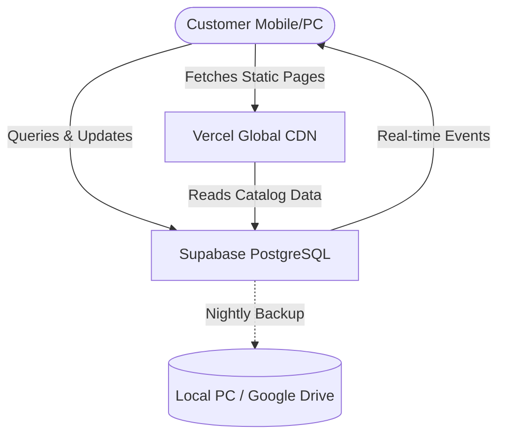

# Project Brief: OM General Store & Artisanal Specialties

This document summarizes the requirements, constraints, architectural decisions, and branding strategies discussed for the family business e-commerce platform.

---

## 1. Business Profile & Offerings

The business is a combination of a traditional local general store and an artisanal kitchen specializing in homemade food items and refreshing drinks.

### Specialties (High-Margin / Signature Products)
*   **Punjabi Toast Biscuits & Khari:** Traditional, crispy, baked goods.
*   **OMmade Masala:** Homemade, high-quality, signature spice blends.
*   **Masala Soda:** A refreshing, fizzy house specialty drink made with local ingredients.

### General Store Inventory (Daily Essentials)
*   Milk & Curd
*   Cold Drinks
*   Ice Cream
*   Other daily general merchandise.

---

## 2. Core Platform Features

The website must be fast, reliable, and support local delivery.

1.  **Digital Catalog & Ordering:** An interactive menu showcasing signature products and daily essentials.
2.  **Shopping Cart & Checkout:** Seamless local checkout experience.
3.  **Delivery & Tracking:** A system to handle local delivery routing and live order status tracking (e.g., received $\rightarrow$ preparing $\rightarrow$ out for delivery $\rightarrow$ delivered).
4.  **Estimated Traffic:** 300 to 400 active monthly local users.

---

## 3. Brand & Photography Strategy (The Storefront Constraint)

### The Constraint
*   The physical shop is leased and in a worn-down condition.
*   The landlord does not permit renovations.
*   Wide shots of the storefront/interior are not presentable for a modern web catalog.

### The Solution
*   **Macro (Close-Up) Photography:** Focus photography entirely on high-quality, close-up shots of the foods (flaky layers of the Khari, bubbles in the Masala Soda, vibrant colors of the OMmade Masala).
*   **Cozy Storefront Illustration:** Use a stylized vector illustration of the shop instead of a photo. This reframes the "worn-down" look into "neighborhood heritage charm."
*   **Premium Packaging:** Shoot products in simple, high-quality packaging (like stamped brown kraft bags or minimalist jars), which instantly elevates the brand online.

---

## 4. Architecture & Hosting Strategy

To minimize cost, complexity, and maintenance overhead while ensuring maximum speed and stability, we are bypassing heavy cloud platforms (like AWS/Azure) in favor of a modern **serverless architecture**:

| Component | Technology | Cost | Purpose |
| :--- | :--- | :--- | :--- |
| **Frontend Framework** | **Next.js (React)** | Free | Renders static pages for instant load speeds on mobile data. |
| **Web Hosting** | **Vercel** | Free | Deploys the frontend globally with zero server maintenance. |
| **Backend & DB** | **Supabase (PostgreSQL)** | Free | Stores inventory, accounts, and orders; handles real-time delivery tracking. |
| **Downtime Fallback** | **WhatsApp / Call Integration** | Free | Direct fallback ordering if database or internet connection is down. |
| **Backup System** | **Auto-Backup Script** | Free | Weekly/daily local Excel backup of orders for safety. |

---

## 5. Implementation Roadmap (Vibe-Skills Governed)

To keep development organized and correct, we will utilize the local **Vibe-Skills Harness** to run the workflow:

1.  **Activation:** Run `install.ps1` to bind the harness to the workspace.
2.  **Requirements Freeze:** Generate `requirement_doc` under `vibe` governance to finalize DB schemas and product pages.
3.  **UI & Database Development:** Build the Next.js catalog pages and configure Supabase tables.
4.  **Testing & Review:** Verify payment flows, cart states, and the delivery tracker.
5.  **Deployment:** Deploy to Vercel and connect a custom domain.
